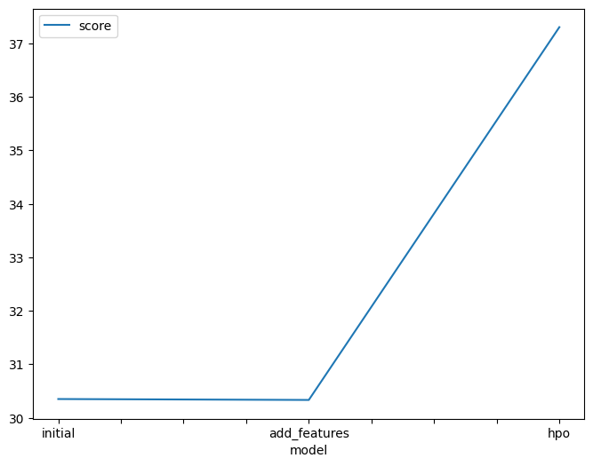
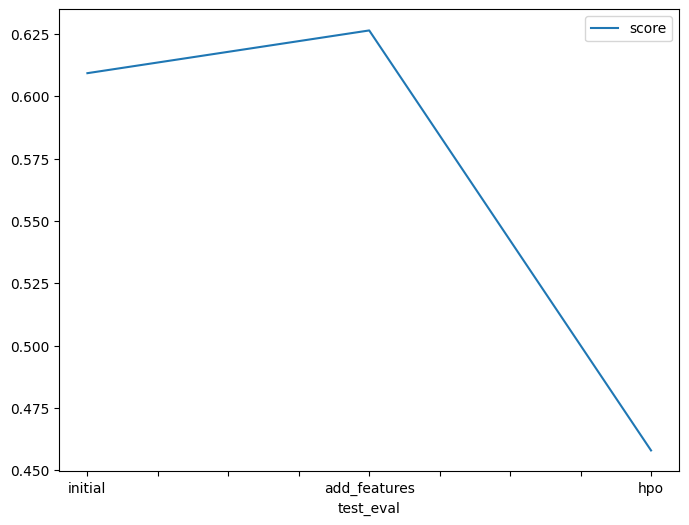

# Report: Predict Bike Sharing Demand with AutoGluon Solution
#### SRIJA ARUMALLA

## Initial Training
### What did you realize when you tried to submit your predictions? What changes were needed to the output of the predictor to submit your results?
Had to go through the documentation to get optimised results, but couldn't get the result below 0.5 as expected. 

### What was the top ranked model that performed?
Hypertuned model 
## Exploratory data analysis and feature creation
### What did the exploratory analysis find and how did you add additional features?
Independent features season and weather were initially read as integer. Since these are categorical variables, they were transformed into category data type.Workday and holiday are both binary fields and humidity and windspeed are left and right skewed respectively.
After probing and considering the features, casual and registered, it was noticed that the RMSE scores improved significantly during cross-validation and these independent features were highly co-related to the target variable count. However, the features casual and registered are only present in the train dataset and absent in the test data; hence, these features were ignored/dropped during model training.

### How much better did your model preform after adding additional features and why do you think that is?
The addition of additional features model performance is almost similar in comparison to the initial/raw model (without EDA and/or feature engineering) performance.
The model performance improved after converting certain categorical variables with integer data types into their true categorical datatypes.
Moreover, splitting the datetime feature into multiple independent features such as year, month, day and hour along with the addition of day_type, further improved the model performance because these predictor variables aid the model assess seasonality or historical patterns in the data more effectively.

## Hyper parameter tuning
### How much better did your model preform after trying different hyper parameters?
Hyperparameter tuning was beneficial because it enhanced the model's performance compared to the initial submission. while performing hyperparameter optimization using autogluon, the 'time_limit' and 'presets' parameters are quite crucial.Hyperparameter tuned models delivered competitive performances in comparison to the model with EDA and added features,and also performed exceptionally better on the Kaggle (test) dataset.

### If you were given more time with this dataset, where do you think you would spend more time?
Given more time to work with this dataset, I would like to investigate additional potential outcomes when AutoGluon is run for an extended period with a high quality preset and enhanced hyperparameter tuning, try to figure out more ways to improve on the features as they seem to be the ones that lead to improvement of the score

### Create a table with the models you ran, the hyperparameters modified, and the kaggle score.
|index|model|timelimit|presets|hp-method|score|
|---|---|---|---|---|---|
|0|initial|time\_limit = 600|presets='best\_quality'|none|0\.60933|
|1|add\_features|time\_limit=600|presets='best\_quality'|problem\_type = 'regression'|0\.62648|
|2|hpo|time\_limit=600|presets='best\_quality'|tabular autogluon|0\.45792|
### Create a line plot showing the top model score for the three (or more) training runs during the project.

### Create a line plot showing the top kaggle score for the three (or more) prediction submissions during the project.

## Summary
 Hyperparameter tuning using AutoGluon also offered improved performance over the initial raw submission; and it was better than that of the model with EDA, feature engineering and no hyperparameter tuning.Working forward my goal would be to improve the model by taking into consideration the working hours which impact the bike demand and the seasonal spikes and lows.
