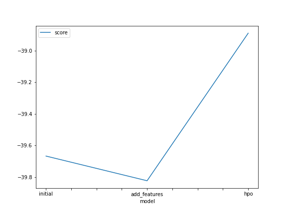
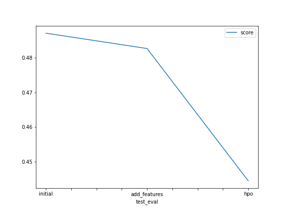

# Report: Predict Bike Sharing Demand with AutoGluon Solution
#### Stephen Williams

## Initial Training
### What did you realize when you tried to submit your predictions? What changes were needed to the output of the predictor to submit your results?
Negative predicted counts don't make sense in this context, so this required correcting those to have a minimum of 0.

### What was the top ranked model that performed?
Weighted_Ensemble_L2

## Exploratory data analysis and feature creation
### What did the exploratory analysis find and how did you add additional features?
There were features present in the training set that were not present in the test set of data. New categorical features were created from the datetime column, and were also encoded as indicator variable columns. Later, I also added higher order terms of the numerical columns.

### How much better did your model preform after adding additional features and why do you think that is?
The Kaggle score went from 0.48272 to 0.48716. By adding squared terms, the model can allow for diminishing or increasing returns.

## Hyper parameter tuning
### How much better did your model preform after trying different hyper parameters?
The Kaggle score decreased to 0.44448. Since hyperparameter tuning can be a time consuming process, the time constraint can severely hinder how well each model is tuned during the training process.

### If you were given more time with this dataset, where do you think you would spend more time?
I would try adding interaction terms and let AutoGluon run for a longer period of time.

### Create a table with the models you ran, the hyperparameters modified, and the kaggle score.
|model|hpo1|hpo2|hpo3|score|
|--|--|--|--|--|
|initial|time_limit = 600, presets = "best_quality"|?|?|0.48272|
|add_features|time_limit = 600, presets = "best_quality"|?|?|0.48716|
|hpo|time_limit = 3600, presets = "best_quality"|?|?|0.44448|

### Create a line plot showing the top model score for the three (or more) training runs during the project.

### Create a line plot showing the top kaggle score for the three (or more) prediction submissions during the project.

TODO: Replace the image below with your own.

## Summary
TODO: Add your explanation
